# SsafyPlayTime

> ## ⚔️ 친구들과 웃으며 즐기는 물리 기반 멀티플레이 파티 게임

- **서비스명**: SsafyPlayTime
- **개발 기간**: 2026.02.19 ~ 2026.03.30
- **개발 인원**: 6명 (Unity Client : 6명)

 

# 목차

- [💡 기획 배경](#-기획-배경)
- [✨ 서비스 주요 기능](#-서비스-주요-기능)
- [📱 주요 화면 및 기능 소개](#-주요-화면-및-기능-소개)
- [🛠️ 프로젝트 핵심 기술](#core-tech)
- [👥 팀원 소개](#-팀원-소개)
- [⚙️ 기술 스택](#tech-stack)

 

# 💡 기획 배경

### 기존 게임의 피로 요소
- 🎯 의무적인 미션 수행 : 재미보다 보상 획득이 우선되어 플레이 피로도가 높아짐
- 📝 복잡한 가입 절차 : 실명 인증·이메일 인증 등 번거로운 과정으로 이탈이 발생함
- ⏱️ 길어지는 플레이타임 : 한 판의 소요 시간이 길어 가볍게 즐기기 어려움
- 🚧 높은 진입장벽 : 복잡한 시스템과 구조로 인해 신규 유저의 접근이 어려움

### SSAFY PlayTime이 제안하는 개선 방향
> **움직이고, 부딪히고, 던지는 그 순간 자체가 재미가 되도록**
- ⚡ **순간의 재미** — 움직이고, 부딪히고, 던지는 과정 자체에서 즉각적인 재미를 제공
- 🕹️ **직관적인 플레이** — 복잡한 설명 없이 뛰고, 줍고, 던지는 단순한 조작으로 누구나 쉽게 적응
- 🪶 **가벼운 플레이 경험** — 빠른 템포의 캐주얼한 진행으로 부담 없이 반복 참여 가능

 

# ✨ 서비스 주요 기능

### 🏠 멀티플레이 로비
- 방 생성 / 입장 / 목록 실시간 업데이트
- 캐릭터 선택 및 모든 참가자 화면 동기화
- 방장 / 참가자 권한 분리 및 준비 상태 동기화

### 💣 공격 아이템
- 블랙홀 폭탄 / 화염 방사기 / 위성 폭격으로 상대 탈락
- 상황에 맞는 아이템 선택으로 전황 역전

### 🔮 변신 아이템
- 커지기 / 작아지기 / 투명화 아이템으로 기믹 역이용
- 위기 상황에서 생존 전략 수단으로 활용

### 👻 유령 투척 시스템
- 탈락 후 유령이 되어 폭탄 · 바나나 껍질 투척
- 생존자들의 경기에 지속적으로 영향을 줄 수 있는 참여 구조

### 👁️ 관전 카메라
- 탈락 후 유령이 되어 폭탄 · 바나나 껍질 투척
- 게임 흐름을 끝까지 관전 가능

### 🏆 게임 종료 및 랭킹
- 게임 종료 순위 결과 모든 참가자 화면에 동일하게 반영
- 탈주 / 방장 강제 종료 시 로비로 안전하게 복귀하는 예외 처리

 

# 📱 주요 화면 및 기능 소개

### 1. **로비**

| 방 생성 | 캐릭터 선택 |
|:---:|:---:|
|  | 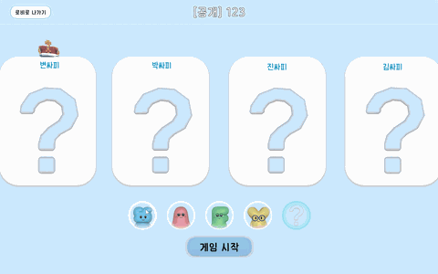 |

- 방을 생성하거나 목록에서 방을 선택해 입장할 수 있습니다.
- 캐릭터 선택 시 모든 참가자 화면에 실시간으로 반영됩니다.
- 방장 외 모든 참가자가 준비 완료하면 방장이 게임을 시작할 수 있습니다.

### 2. **캐릭터 동작**

| 이동 | 펀치 |
|:---:|:---:|
| 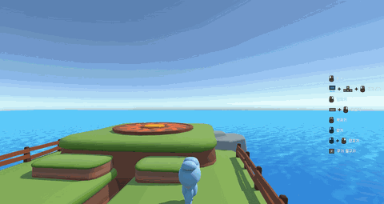 | 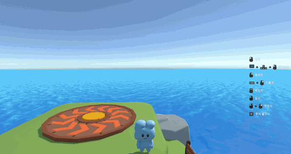 |

| 발차기 | 드롭킥 |
|:---:|:---:|
| 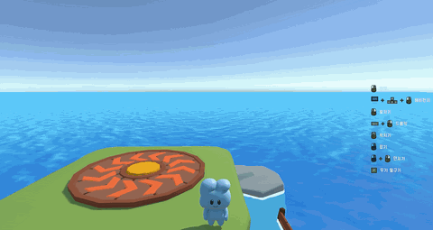 | 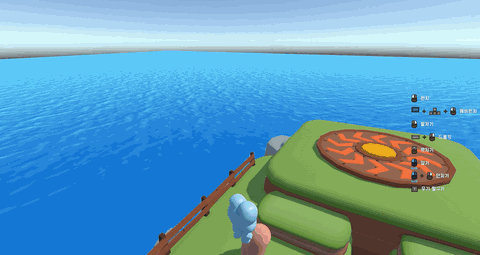 |

| 박치기 | 잡기 |
|:---:|:---:|
| 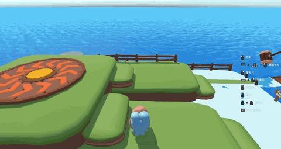 | 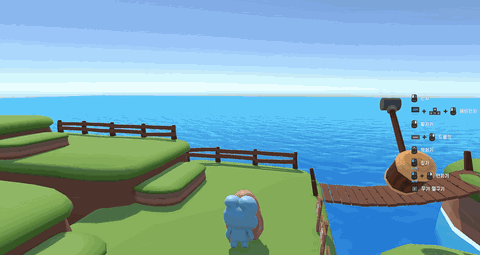 |

| 던지기 |
|:---:|
|  |

- 이동·점프 등 기본 조작은 직관적으로 누구나 바로 적응할 수 있습니다.
- 펀치·발차기·드롭킥·박치기 등 다양한 공격 동작으로 상대를 밀어낼 수 있습니다.
- 잡기·던지기로 상대를 직접 집어 던지는 물리 기반 플레이가 가능합니다.

### 3. **공격 아이템**

| 블랙홀 폭탄 | 화염 방사기 |
|:---:|:---:|
| 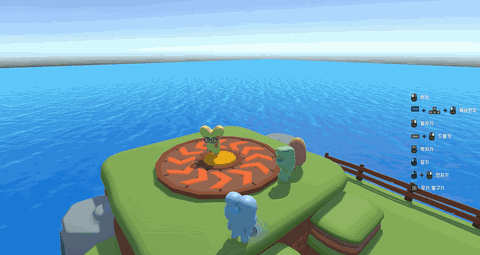 | 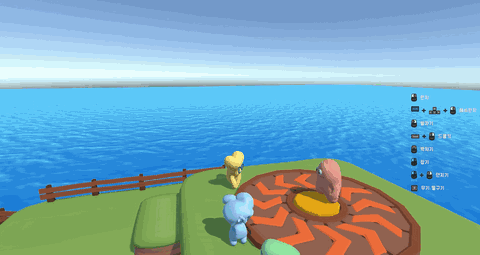 |

| 위성 폭격 |
|:---:|
| 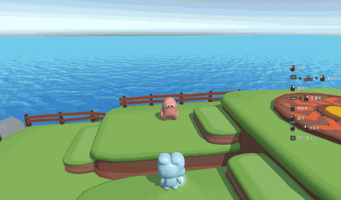 |

- 블랙홀 폭탄·화염 방사기·위성 폭격으로 다른 플레이어를 탈락시킬 수 있습니다.
- 각 아이템마다 범위·지속시간·효과가 달라 상황에 맞는 선택이 중요합니다.

### 4. **변신 아이템**

| 거대화 | 소형화 |
|:---:|:---:|
| 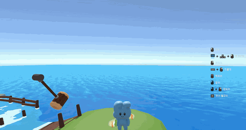 | 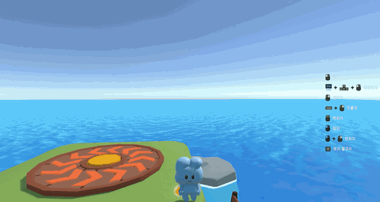 |

| 투명화 | 아메리카노 |
|:---:|:---:|
| 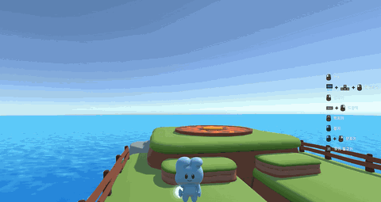 | 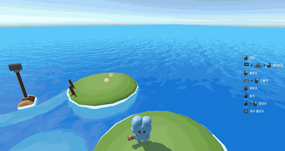 |

- 커지기·작아지기·투명화 아이템으로 위기 상황을 역전할 수 있습니다.
- 상대의 공격을 피하거나 기믹을 역이용하는 전략 수단으로 활용됩니다.

### 5. **유령 투척 시스템**

| 폭탄 던지기 | 바나나 껍질 던지기 |
|:---:|:---:|
| 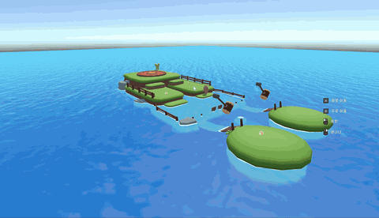 | 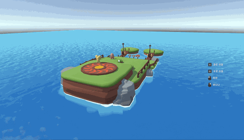 |

- 탈락 후 유령이 되어 생존자들에게 폭탄·바나나 껍질을 던질 수 있습니다.
- 탈락 이후에도 경기에 영향을 줄 수 있어 끝까지 긴장감이 유지됩니다.
- 관전 카메라로 살아있는 다른 플레이어를 자유롭게 구경할 수 있습니다.

### 6. **게임 종료 및 랭킹**

| 게임 종료 및 순위 결과 |
|:---:|
|  |

- 게임 종료 시 전체 순위 결과가 모든 참가자 화면에 동시에 표시됩니다.
- 1등이 새로운 방장이 되어 로비로 복귀하고 바로 다음 게임을 시작할 수 있습니다.

 

# 🛠️ 프로젝트 핵심 기술

### 🔗 Photon Fusion — Host Mode 네트워크 구조

- 플레이어 중 한 명이 **Host**가 되어 모든 게임 로직·물리 연산을 처리하는 구조
- Remote 클라이언트는 입력만 전송하고 Host가 결과를 동기화해 권위 있는 상태 유지
- Host 접속 종료 시 **Host Migration**으로 다른 플레이어가 자동으로 Host 승계

### 📡 [Networked] — State Synchronization

- `[Networked]` 어트리뷰트로 선언된 변수는 Host → Remote 자동 동기화
- 캐릭터 위치·회전·애니메이션 상태·아이템 효과 등 게임 상태를 실시간 반영
- 물리 기반 이동에 **NetworkRigidbody** 적용해 충돌·튕김 동작까지 동기화

### 🌐 AOI (Area of Interest) — 관심 영역 최적화

- 플레이어 주변 일정 범위 내 오브젝트만 네트워크 업데이트 대상으로 한정
- 맵 전체가 아닌 **근접 영역만 동기화**해 불필요한 패킷 트래픽 제거
- 참가자 수 증가에도 네트워크 부하가 선형적으로 늘어나지 않도록 제어

### 📨 RPC (Remote Procedure Call) — 이벤트 전달

- 아이템 사용·탈락 판정·게임 시작·종료 등 **일회성 이벤트**는 RPC로 처리
- `[Rpc(RpcSources.InputAuthority, RpcTargets.All)]` 로 호출자 → 전체 전파
- State Sync(지속 상태)와 RPC(순간 이벤트)를 역할에 따라 명확히 분리 적용

 

# 👥 팀원 소개

<table>
  <tr>
    <td align="center">
      
    </td>
    <td align="center">
      
    </td>
    <td align="center">
      
    </td>
  </tr>
  <tr>
    <td align="center">
       
      <a href="https://github.com/byjun98">변현준</a>
    </td>
    <td align="center">
       
      <a href="https://github.com/kth5352">김태현</a>
    </td>
    <td align="center">
       
      <a href="https://github.com/jumpman-hero">박준영</a>
    </td>
  </tr>
  <tr>
    <td align="center">
      
    </td>
    <td align="center">
      
    </td>
    <td align="center">
      
    </td>
  </tr>
  <tr>
    <td align="center">
       
      <a href="https://github.com/hyekang222">박혜강</a>
    </td>
    <td align="center">
       
      <a href="https://github.com/JinYunSe">진윤세</a>
    </td>
    <td align="center">
       
      <a href="https://github.com/hungryTiger-roar">한민지</a>
    </td>
  </tr>
</table>

 

# ⚙️ 기술 스택

### Client

  
  
  

### IDE

  
  

### Cooperation

  
  
  

 

